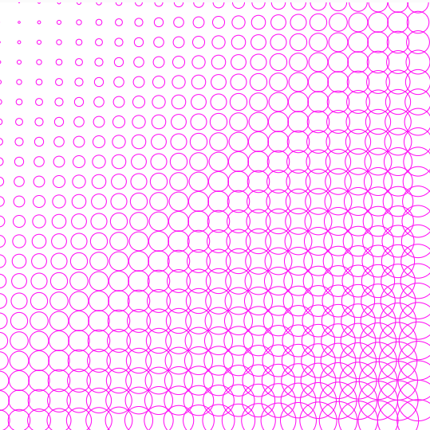
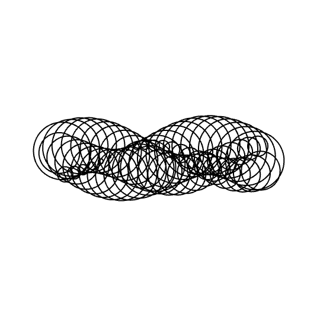

# 181104_ccu
CCU workshop page

## Introduction:
[p5.js](https://p5js.org)  
[processing](https://processing.org)  

## Editor:
[p5.js editor](https://editor.p5js.org)  

## Workshop Example 1

## Workshop Example 2

(Example code and links to topics will be linked after the workshop)

## Resources
[Coding Train / Daniel Shiffman videos](https://thecodingtrain.com)  
[Awesome Generative Art Github](https://github.com/kosmos/awesome-generative-art)  

### Online MOOCS & Tutorials:
[P5.JS CRASH COURSE: RECREATE ART YOU LOVE](https://blog.kadenze.com/creative-technology/p5-js-crash-course-recreate-art-you-love/)  
[Kadenze:Introduction to Programming for the Visual Arts with p5.js](https://www.kadenze.com/courses/introduction-to-programming-for-the-visual-arts-with-p5-js-vi/info)  
[Kadenze: Generative Art and Computational Creativity](https://www.kadenze.com/courses/generative-art-and-computational-creativity/info)  
